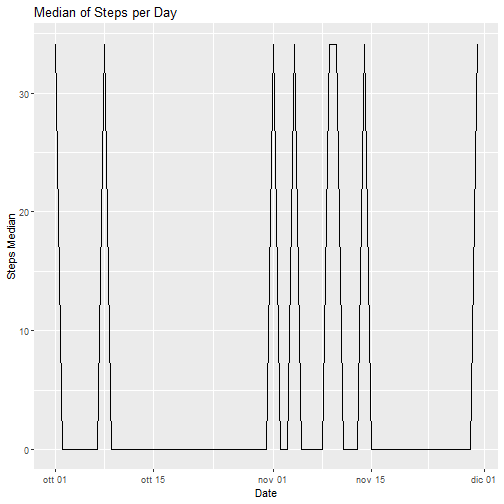

Reproducible Research
=====================
#Week 2 Project assignment

Used Packages


```r
library(dplyr)
```

```
## 
## Attaching package: 'dplyr'
```

```
## The following objects are masked from 'package:stats':
## 
##     filter, lag
```

```
## The following objects are masked from 'package:base':
## 
##     intersect, setdiff, setequal, union
```

```r
library(ggplot2)
```

###Read data


```r
url_file <- "https://d396qusza40orc.cloudfront.net/repdata%2Fdata%2Factivity.zip"
download.file(url_file, destfile=".\\Activity.zip")
unzip(".\\Activity.zip","activity.csv")
ds_act <- read.csv2(".\\activity.csv", header=TRUE, sep=",", na.strings="NA")
```

###Data process/transformation

Conversion of date column to date


```r
ds_act$date=as.Date(ds_act$date,"%Y-%m-%d")
```

Here's the final dataset structure


```r
str(ds_act)
```

```
## 'data.frame':	17568 obs. of  3 variables:
##  $ steps   : int  NA NA NA NA NA NA NA NA NA NA ...
##  $ date    : Date, format: "2012-10-01" "2012-10-01" ...
##  $ interval: int  0 5 10 15 20 25 30 35 40 45 ...
```

###Calculation and rapresentation of total, mean and median number of steps taken per day


Calculation of total, mean and median of steps per day


```r
info_steps_per_day <- ds_act %>% group_by(date) %>% summarize(total_steps = sum(steps, na.rm=TRUE), mean_steps = mean(steps, na.rm=TRUE), median_steps = median(steps, na.rm=TRUE))
```

####Total steps per day graph


```r
g <- ggplot(info_steps_per_day, aes(x = date, y = total_steps)) + geom_line()
g <- g + labs(x="Date", y="Total Steps", title = "Total Steps per Day")
g
```


####Graph of Mean of the steps per day


```r
g <- ggplot(info_steps_per_day, aes(x = date, y = mean_steps)) + geom_line(na.rm=TRUE)
g <- g + labs(x="Date", y="Steps Mean", title = "Mean of Steps per Day")
g
```


The missing values in the graph refer to days where all values are "NA"

####Graph of Median of the steps per day

```r
g <- ggplot(info_steps_per_day, aes(x = date, y = median_steps)) + geom_line(na.rm=TRUE)
g <- g + labs(x="Date", y="Steps Median", title = "Median of Steps per Day")
g
```


The missing values in the graph refer to days where all values are "NA".

In all the graph, all the values related to Median are equal to zero. 

The reason is that more than the 50% of values are equal to zero for each of that days .

###Calculation and rapresentation of average daily activity pattern

Calculation of total, mean and median of steps per day


```r
info_5_min_interval <- ds_act %>% group_by(interval) %>% summarize(mean_steps = mean(steps, na.rm=TRUE))
summary(info_5_min_interval)
```

```
##     interval        mean_steps     
##  Min.   :   0.0   Min.   :  0.000  
##  1st Qu.: 588.8   1st Qu.:  2.486  
##  Median :1177.5   Median : 34.113  
##  Mean   :1177.5   Mean   : 37.383  
##  3rd Qu.:1766.2   3rd Qu.: 52.835  
##  Max.   :2355.0   Max.   :206.170
```

####Graph of Mean of the steps per 5-minutes interval


```r
g <- ggplot(info_5_min_interval, aes(x = interval, y = mean_steps)) + geom_line(na.rm=TRUE)
g <- g + labs(x="5-minutes Interval", y="Steps Mean", title = "Mean of Steps per 5-minutes Interval")
g
```


Code for calculating hour and minutes related to the 5-minutes interval with max steps number

```r
max_interval <- info_5_min_interval[which.max(info_5_min_interval$mean_steps),"interval"]
hour_max_interval <- max_interval %/% 100
minutes_max_interval <- max_interval %% 100
```

The 5-minute interval that, on average, contains the maximum number of steps starts at 8:35 a.m.

###Strategy for imputing missing data

The adopted strategy for imputing missing data is to use the mean for that 5-minute interval, etc.


```r
ds_act_new <- ds_act
ds_act_new$steps[is.na(ds_act$steps) & info_5_min_interval$interval == ds_act$interval ] <- info_5_min_interval$mean_steps
head(ds_act)
```

```
##   steps       date interval
## 1    NA 2012-10-01        0
## 2    NA 2012-10-01        5
## 3    NA 2012-10-01       10
## 4    NA 2012-10-01       15
## 5    NA 2012-10-01       20
## 6    NA 2012-10-01       25
```

```r
head(ds_act_new)
```

```
##       steps       date interval
## 1 1.7169811 2012-10-01        0
## 2 0.3396226 2012-10-01        5
## 3 0.1320755 2012-10-01       10
## 4 0.1509434 2012-10-01       15
## 5 0.0754717 2012-10-01       20
## 6 2.0943396 2012-10-01       25
```


Calculation of mean and median of steps per day after imputing missing data


```r
info_steps_per_day_mna <- ds_act_new %>% group_by(date) %>% summarize(total_steps = sum(steps, na.rm=TRUE), mean_steps = mean(steps, na.rm=TRUE), median_steps = median(steps, na.rm=TRUE))
```

####Total steps per day graph after imputing missing data


```r
g <- ggplot(info_steps_per_day_mna, aes(x = date, y = total_steps)) + geom_line(na.rm=TRUE)
g <- g + labs(x="Date", y="Total Steps", title = "Total Steps per Day")
g
```


####Graph of Mean of the steps per day after imputing missing data


```r
g <- ggplot(info_steps_per_day_mna, aes(x = date, y = mean_steps)) + geom_line(na.rm=TRUE)
g <- g + labs(x="Date", y="Steps Mean", title = "Mean of Steps per Day")
g
```


The missing values in the graph refer to days where all values are "NA"

####Graph of Median of the steps per day after imputing missing data

```r
g <- ggplot(info_steps_per_day_mna, aes(x = date, y = median_steps)) + geom_line(na.rm=TRUE)
g <- g + labs(x="Date", y="Steps Median", title = "Median of Steps per Day")
g
```



####Analysis avout Value differences from original dataset and dataset with imputed missing data


```r
na_date_list <- unique(ds_act$date[is.na(ds_act$steps)])
not_na_date_list <- unique(ds_act$date[!is.na(ds_act$steps)])
intersection_list_len <- length(intersect(not_na_date_list,na_date_list))
intersection_list_len
```

```
## [1] 0
```

In the initial dataset a day has either all 5-minutes interval equal to NA ('NA days') or all 5-minutes interval dfferent NA ('not NA days').
Infact the interscection between the list of dates with NA velues and dates with no NA values sa a 0 lenght list.

Due to this fact the mean and median of total number of steps taken per day values differ from original dataset and imputed missing dataset only in the 'NA days'.

Referring to the questions in submission section referred to this part.

*Q - Do mean and media values differ from the estimates from the first part of the assignment? *

**A - Yes, the difference is affects only the 'NA days'. After the imputing of missing data, the mean value for these days is the mean of the means of 5-minute intervals, the median value for these days is the median of the means of 5-minute intervals.**


*Q - What is the impact of imputing missing data on the estimates of the total daily number of steps?*

**A- The 'not na days' are not affected, the 'NA days' are affected, and thie value is the sum of the means of 5-minute intervals.**

###Differences in activity patterns between weekdays and weekends


```r
ds_act$weekend <- as.factor(ifelse(weekdays(ds_act$date) %in% c("sabato", "domenica"),"weekend","weekday"))
info_5_min_interval_weekend <- ds_act %>% group_by(interval,weekend) %>% summarize(mean_steps = mean(steps, na.rm=TRUE))
summary(info_5_min_interval_weekend)
```

```
##     interval         weekend      mean_steps     
##  Min.   :   0.0   weekday:288   Min.   :  0.000  
##  1st Qu.: 588.8   weekend:288   1st Qu.:  1.854  
##  Median :1177.5                 Median : 26.295  
##  Mean   :1177.5                 Mean   : 39.208  
##  3rd Qu.:1766.2                 3rd Qu.: 62.321  
##  Max.   :2355.0                 Max.   :234.103
```

```r
g <- ggplot(info_5_min_interval_weekend, aes(x = interval, y = mean_steps)) + facet_wrap(. ~ weekend, nrow=2, ncol=1) + geom_line()
g <- g + labs(x="5-minute interval", y="Steps Mean", title = "Steps Mean - Weekend vs. Weekday")
g
```


